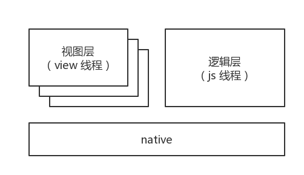
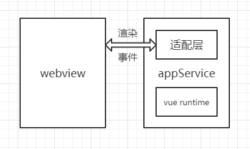

# kbone

## 简介

微信小程序是一种全新的连接用户与服务的方式，它可以在微信内被便捷地获取和传播，同时具有出色的使用体验。小程序提供了一个简单、高效的应用开发框架和丰富的组件及API，帮助开发者在微信中开发具有原生 APP 体验的服务。

小程序的技术底层依托于 web 技术，和 web 端开发相似却又不同。在 web 中，开发者可以使用浏览器提供的 dom/bom api 来操作渲染内容，同时编写 js 脚本来执行页面逻辑；在小程序中渲染和逻辑则完全分离，开发者可以编写 js 脚本，但是无法直接调用 dom/bom api，渲染和逻辑的交互通过数据和事件来驱动，开发者可以不用在去关系渲染的细节。

如上所述，小程序的底层实现是封闭的，现有的 web 代码无法直接在小程序环境里运行，对于有多端需求的项目来说代码的维护是一个难题，加一个功能或者改一个样式可能需要改动两套代码。因此，kbone 作为一套解决方案应运而生，用于支持让一个 vue 项目可以同时在 web 端和小程序端被使用。

> PS：vue 是市面上非常流行的一款前端框架，具体介绍可以[查看文档](https://cn.vuejs.org/index.html)。

## 原理

方案设计有如下几个前提：

1. 为了更好的复用组件，尽可能完整的支持 vue 的特性
2. 在小程序端的渲染结果要尽可能接近 h5 端

在前提 1 的限制下，直接将 vue 组件直接转换成小程序代码的方式不可取，因为这种做法会限制大部分 vue 特性，而且在一些可实现特性的兼容方面也很难做得完美，所以必须将 vue runtime 给引进来。vue 底层依赖了小程序里没有的 dom 接口，想要引入 vue runtime，要么对其底层进行修改，要么提供适配层接口。为了方便开发维护，同时也为了尽可能避免引入难以预料的问题，准备以提供适配层的方式来支持。

适配层可以理解是一棵在 appService 端运行的轻型 dom 树，它提供基础的 dom/bom api。appService 端和 webview 端的交互通过适配层来进行，vue runtime 和业务代码不直接触达和 webview 端的通信接口（如 setData 等接口）。

dom 树本身是没有固定模式可循的，它的层级、dom 节点数量都是不固定的，没有办法用固定的 wxml 将其描述出来，因此这里使用了小程序自定义组件的自引用特性。

自定义组件支持使用自己作为其子节点，也就是说可以用递归引用的方式来构造任意层级、任意节点数量的自定义组件树，所以可以将若干个 dom 节点映射成一个小程序的自定义组件，每一个自定义组件相当于描述出了 dom 树的一部分，然后将这些自定义组件拼接起来就可以描述出一棵完整的 dom 树。

如上图所述，虚线框将一棵 dom 树划分成五棵子树，每棵子树最多不超过三层。这个虚线框就可以理解成是一个自定义组件，每个自定义组件渲染一棵层级不超过三层的 dom 子树，然后将这些自定义组件拼接起来就相当于渲染出了一棵完整的 dom 树。

## 使用

这里提供了一份[开发指南](./docs/quickstart.md)，方便开发者快速上手此方案。

## 问题

此方案虽然将整个 vue runtime 包含进来并提供了适配层，但是也不是银弹，无法满足所有场景，具体限制可参考[问题文档](./docs/question.md)。

## 案例

