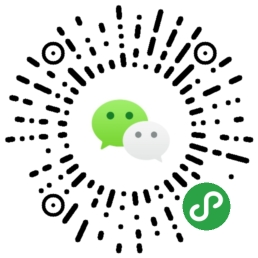

# kbone

kbone 是一个致力于微信小程序和 Web 端同构的解决方案。

## 简介

微信小程序的底层模型和 Web 端不同，我们想直接把 Web 端的代码挪到小程序环境内执行是不可能的。kbone 的诞生就是为了解决这个问题，它实现了一个适配器，在适配层里模拟出了浏览器环境，让 Web 端的代码可以不做什么改动便可运行在小程序里。

这里有个简单的[代码片段](https://developers.weixin.qq.com/miniprogram/dev/devtools/minicode.html)：[https://developers.weixin.qq.com/s/R9Hm0Qm67Acd](https://developers.weixin.qq.com/s/R9Hm0Qm67Acd)，可以使用开发者工具打开看看效果。

因为 kbone 是通过提供适配器的方式来实现同构，所以它的优势很明显：

* 大部分流行的前端框架都能够在 kbone 上运行，比如 Vue、React、Preact 等。
* 支持更为完整的前端框架特性，因为 kbone 不会对框架底层进行删改（比如 Vue 中的 v-html 指令、Vue-router 插件）。
* 提供了常用的 dom/bom 接口，让用户代码无需做太大改动便可从 Web 端迁移到小程序端。
* 在小程序端运行时，仍然可以使用小程序本身的特性（比如像 live-player 内置组件、分包功能）。
* 提供了一些 Dom 扩展接口，让一些无法完美兼容到小程序端的接口也有替代使用方案（比如 getComputedStyle 接口）。

## 使用

为了可以让开发者可以更自由地进行项目的搭建，以下提供了三种方式，任选其一即可：

### 使用 kbone-cli 快速开发

对于新项目，可以使用 `kbone-cli` 来创建项目，首先安装 `kbone-cli`:

```
npm install -g kbone-cli
```

创建项目：

```
kbone init my-app
```

进入项目，按照 README.md 的指引进行开发：

```
// 开发小程序端
npm run mp

// 开发 Web 端
npm run web

// 构建 Web 端
npm run build
```

> PS：项目基于 webpack 构建，关于 webpack 方面的配置可以[点此查看](https://webpack.js.org/configuration/)，而关于小程序构建相关的详细配置细节可以[参考此文档](https://wechat-miniprogram.github.io/kbone/docs/guide/tutorial.html)。

### 使用模板快速开发

除了使用 kbone-cli 外，也可以直接将现有模板 clone 下来，然后在模板基础上进行开发改造：

* [Vue 项目模板](https://github.com/wechat-miniprogram/kbone-template-vue)
* [React 项目模板](https://github.com/wechat-miniprogram/kbone-template-react)
* [Preact 项目模板](https://github.com/wechat-miniprogram/kbone-template-preact)
* [Omi 项目模板](https://github.com/omijs/template-kbone)

项目 clone 下来后，按照项目中 README.md 的指引进行开发。

> PS：项目基于 webpack 构建，关于 webpack 方面的配置可以[点此查看](https://webpack.js.org/configuration/)，而关于小程序构建相关的详细配置细节可以[参考此文档](https://wechat-miniprogram.github.io/kbone/docs/guide/tutorial.html)。

### 手动配置开发

此方案基于 webpack 构建实现，如果你不想要使用官方提供的模板，想要更灵活地搭建自己的项目，又或者是想对已有的项目进行改造，则需要自己补充对应配置来实现 kbone 项目的构建。

一般需要补充两个配置：

* 构建到小程序代码的[ webpack 配置](https://webpack.js.org/configuration/)
* 使用 webpack 构建中使用到的特殊插件[ mp-webpack-plugin 配置](https://wechat-miniprogram.github.io/kbone/docs/config/)

[点此可以查看](https://wechat-miniprogram.github.io/kbone/docs/guide/tutorial.html)具体配置方式和操作流程。

## 文档

更为详细的说明和指引，可点击[查看文档](https://wechat-miniprogram.github.io/kbone/docs/)。

## 问题

此方案虽然将整个 Web 端框架包含进来并提供了适配层，但是也不是银弹，无法满足所有场景，具体限制可参考[问题文档](https://wechat-miniprogram.github.io/kbone/docs/qa/)。如果还遇到其他问题，可在 [issue](https://github.com/wechat-miniprogram/kbone/issues) 中反馈。

## 选择

业内其实已经出现了很多关于同构的解决方案了，每个方案都有自己的优劣，不存在能够完美解决所有问题的方案。kbone 也一样，它的优势在上面提到过，而它的不足也是它的实现原理带来的。kbone 是使用一定的性能损耗来换取更为全面的 Web 端特性支持。

所以关于性能方面，如果你对小程序的性能特别苛刻，建议直接使用原生小程序开发；如果你的页面节点数量特别多（通常在 1000 节点以上），同时还要保证在节点数无限上涨时仍然有稳定的渲染性能的话，可以尝试一下业内采用静态模板转译的方案；其他情况就可以直接采用 kbone 了。

## 贡献者

<table>
  <tbody>
    <tr>
      <td><a target="_blank" href="https://github.com/JuneAndGreen"></a></td>
      <td><a target="_blank" href="https://github.com/dntzhang"></a></td>
      <td><a target="_blank" href="https://github.com/stephenml"></a></td>
      <td width="92px"><a target="_blank" href="https://github.com/wechat-miniprogram/kbone/graphs/contributors">感谢你们</a></td>
    </tr>
  </tbody>
</table>

查看[代码贡献规范](https://wechat-miniprogram.github.io/kbone/docs/guide/develop.html)。

## 交流群

QQ 交流群：926335938

## 案例



